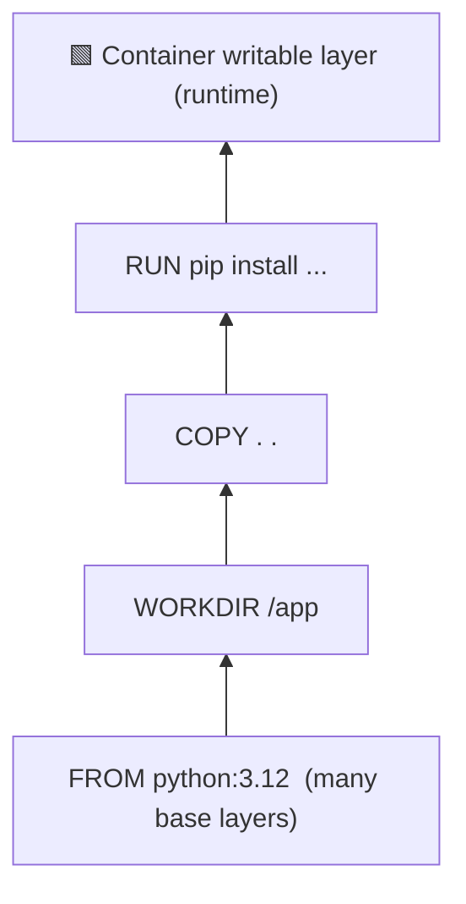

# Understanding Image Layers 🔬

Docker images aren't single files — they're stacks of read-only **layers**. Each Dockerfile instruction that modifies the filesystem creates a new layer on top of the previous ones. When you run a container, Docker adds one thin writable layer on top for any changes the container makes.



This layered structure is what makes Docker fast: if a layer hasn't changed since the last build, Docker reuses the **cached** version instead of rebuilding it.

## Inspect Your Image's Layers

See exactly what layers make up your image:

```bash
docker history quote-app:v1
```

Each row is a layer. You can see the instruction that created it and how much space it adds. Notice that most of the size comes from the base Python image.

Check the total image size:

```bash
docker images quote-app
```

That's a lot of megabytes for a tiny app that returns quotes. You'll fix that significantly in later sections — but first, there's an important trap to understand.

## The Layer Cleanup Pitfall ⚠️

A very common pattern looks like this when someone wants to install a system package and clean up afterwards:

```dockerfile no-run-button
# 🚨 WRONG: cleaning up in a separate layer doesn't shrink the image
RUN apt-get update && apt-get install -y curl
RUN rm -rf /var/lib/apt/lists/*
```

This *seems* correct — install the package, then delete the cache. But it **doesn't work** the way you'd expect.

Each `RUN` instruction creates a **new layer**. When you delete files in a later layer, the files aren't removed from the image — they're just hidden. The original layer containing the apt cache is still embedded in the image, still consuming space.

### See It in Action

1. Create a file named `Dockerfile.bad-cleanup` with the following contents:

    ```dockerfile save-as=Dockerfile.bad-cleanup
    FROM python:3.12

    WORKDIR /app

    COPY requirements.txt .
    RUN pip install --no-cache-dir -r requirements.txt

    # Bad: cleanup in a separate layer — the cache is still in the image!
    RUN apt-get update && apt-get install -y curl
    RUN rm -rf /var/lib/apt/lists/*

    COPY src/ ./src/

    EXPOSE 5050
    CMD ["python", "src/app.py"]
    ```

2. Build it:

    ```bash
    docker build -f Dockerfile.bad-cleanup -t quote-app:bad-cleanup .
    ```

3. Now create a file named `Dockerfile.good-cleanup` that will install and clean up in **the same `RUN` command**:

    ```dockerfile save-as=Dockerfile.good-cleanup
    FROM python:3.12

    WORKDIR /app

    COPY requirements.txt .
    RUN pip install --no-cache-dir -r requirements.txt

    # Good: install and cleanup in a single layer
    RUN apt-get update && apt-get install -y curl \
        && rm -rf /var/lib/apt/lists/*

    COPY src/ ./src/

    EXPOSE 5050
    CMD ["python", "src/app.py"]
    ```

4. Build it:

    ```bash
    docker build -f Dockerfile.good-cleanup -t quote-app:good-cleanup .
    ```

5. Compare the sizes with the `docker images` command:

    ```bash
    docker images quote-app
    ```

The `good-cleanup` image is noticeably smaller. By combining the install and cleanup into a single `RUN`, the apt cache files are never committed to any layer.

> [!TIP]
> The rule of thumb: if you create temporary files (downloaded archives, build artifacts, package manager caches) during a `RUN` step, delete them in that same `RUN` step. This is especially important with `apt-get`, `yum`, `apk`, and similar package managers.

## Clean Up the Test Images

```bash
docker rmi quote-app:bad-cleanup quote-app:good-cleanup
```

Now that you understand how layers work, it's time to use that knowledge to make your builds faster — by controlling which layers get cached and which get rebuilt.
