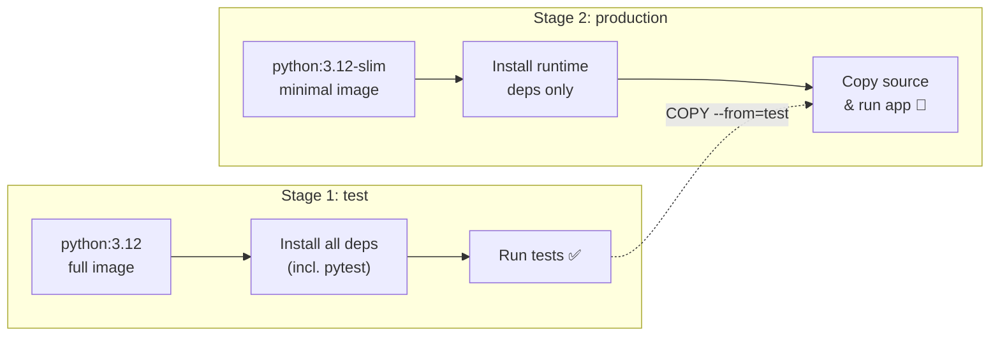

# Multi-Stage Builds 📦

Your image is getting better, but it's still carrying around the full `python:3.12` base image. That image ships with a compiler, package build tools, and hundreds of megabytes of things your app will never use at runtime.

**Multi-stage builds** let you use one environment to build and test your app, and a completely different (smaller) environment to run it. Docker only ships the final stage — everything else is discarded.



## Check Your Current Image Size

Before making changes, note where you're starting from:

```bash
docker images quote-app:v2
```

Keep that number in mind.

## Write the Multi-Stage Dockerfile

The project already includes test files in `tests/` and dev dependencies in `requirements-dev.txt`. Time to use them.

1. Update the `Dockerfile` to be multi-stage by using the following content:

    ```dockerfile save-as=Dockerfile
    # ---- Stage 1: Test ----
    # Run tests using the full Python image with dev dependencies.
    # If tests fail, the build stops here — nothing broken ships.
    FROM python:3.12 AS test

    WORKDIR /app

    COPY requirements*.txt ./
    RUN pip install --no-cache-dir -r requirements.txt -r requirements-dev.txt

    COPY . .

    RUN python -m pytest tests/ -v


    # ---- Stage 2: Production ----
    # Use the slim image for the smallest possible runtime footprint.
    # Dev dependencies, test files, and the test stage itself never make it here.
    FROM python:3.12-slim AS production

    WORKDIR /app

    # COPY --from=test creates an explicit dependency on the test stage.
    # BuildKit analyses the stage graph and will skip stages whose outputs aren't
    # referenced — without this line it could skip the test stage entirely.
    COPY --from=test /app/requirements.txt .
    RUN pip install --no-cache-dir -r requirements.txt

    COPY src/ ./src/

    USER nobody

    EXPOSE 5050
    CMD ["python", "src/app.py"]
    ```

2. Build the new multi-stage image and tag it as `v3`:

    ```bash
    docker build -t quote-app:v3 .
    ```

    Watch the output — you'll see pytest run in the test stage, then a fresh production image being assembled from `python:3.12-slim`.

    > [!NOTE]
    > The `COPY --from=test` in the production stage is what forces BuildKit to run the test stage. BuildKit builds a dependency graph between stages and will skip any stage whose outputs are never referenced. If the production stage copied `requirements.txt` directly from the build context instead, BuildKit could skip the test stage entirely — and a broken build could ship.

## Compare the Sizes

Check the sizes of the images by using the `docker images` command:

```bash
docker images quote-app
```

The `v3` image should be dramatically smaller than `v2`. The difference comes from switching from `python:3.12` (the full Debian-based image) to `python:3.12-slim` in the production stage.

## Verify Tests Are the Gatekeeper

The real power of this pattern is that a failing test blocks the entire build. 

1. Break a test to see it in action:

    ```bash
    echo "assert False  # intentional failure" >> tests/test_app.py
    docker build -t quote-app:v3 .
    ```

    The build fails during the test stage — the production image is never created. 
    
2. Remove the line you just added:

    ```bash
    sed -i '$ { /False/d }' tests/test_app.py
    ```

3. Now rebuild cleanly:

    ```bash
    docker build -t quote-app:v3 .
    ```

## Verify Dev Tools Are Gone

1. Confirm that `pytest` isn't present in the production image:

    ```bash
    docker run --rm quote-app:v3 python -m pytest --version
    ```

    You should see output similar to the following: 

    ```console no-copy-button no-run-button
    /usr/local/bin/python: No module named pytest
    ```
    
    Your production image contains only what it needs to run the app. 🎯

2. Restart the app with the new image:

    ```bash
    docker stop quote-app && docker rm quote-app
    docker run -d -p 5050:5050 --name quote-app quote-app:v3
    curl http://localhost:5050
    ```

In the next section, you'll explore base image choices in more depth — and tackle the most dangerous Dockerfile mistake: baking secrets into your images.
